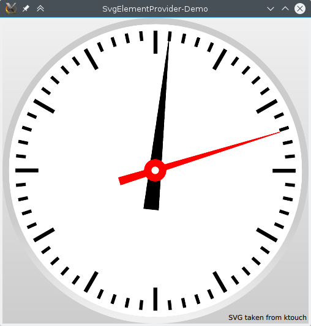

# SvgElementProvider

SvgElementProvider is a QQuickImageProvider that is able to extract elements from Scalable Vector Graphics (SVG).
After adding an instance of this class to the QML engine, is is possible to load SVG elements into Images.

To use this module in your project, simply copy the relevant source file svgelementprovider.cpp and the corresponding header into your tree and register an instance at the QML engine as image provider.

A little demo can be found in the qml sub-directory and shows the usage of the module. It uses a SVG file which contains the components of an analog clock as distinct elements. The demo loads the elements into Image items and animates them separately. The result is shown in the following picture. 



# Building the demo
## General
- Download and unpack the project to an arbitrary place.
- Open a console and change into the root folder of the unpacked project.
- Create a build directory and go into it.
- Create the buildsystem by invoking CMake.
- Build and execute the binary.

## Linux
Assuming that you are in the root folder of the project, the following line should build and execute the demo.
```
$ mkdir build && cd build && cmake .. && make && ./SvgElementProviderDemo
```

## Windows
TODO

# Requirements
- CMake >= 2.8.12
- Qt >= 5.4

# Troubleshooting
If you have problems rendering the GUI (e.g. because your graphics card does not support the features required by Qt Quick 2) try to force software rendering by exporting QT_OPENGL=software.

# TODO
- Add QML plugin code.